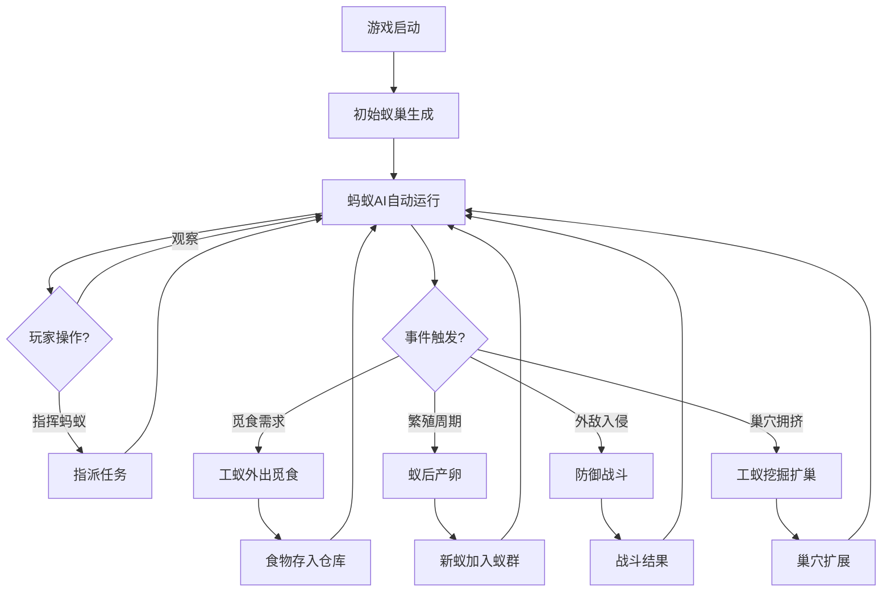

## 1. 产品概述

蚂蚁部落模拟是一款科普自然类的蚁群模拟游戏，玩家以俯视视角观察和指挥蚂蚁部落在地下巢穴与地面世界的日常活动。通过觅食、挖掘、繁殖、防御等核心玩法，让玩家深入了解蚂蚁社会的分工协作与生态智慧，寓教于乐。

- 目标用户：自然爱好者、休闲游戏玩家、科普教育受众
- 产品价值：以沉浸式互动体验科普蚂蚁生态，兼具策略性与观赏性

## 2. 核心功能

### 2.1 用户角色

本游戏为单机模拟类，无多角色区分，玩家扮演蚁群的"观察者与指挥者"。

### 2.2 功能模块

1. **主游戏页面**：俯视视角的蚁巢世界，包含地下巢穴和地面场景，蚂蚁自动活动，玩家可交互指挥
2. **状态面板**：实时显示食物储量、蚂蚁数量、蚁群状态等关键信息

### 2.3 页面详情

| 页面名称 | 模块名称 | 功能描述 |
|---------|---------|---------|
| 主游戏页面 | 地下巢穴视图 | 俯视视角展示蚁巢隧道、房间、蚁后室、育儿室等地下结构，蚂蚁在其中自动走动 |
| 主游戏页面 | 地面世界视图 | 展示地面场景，包含食物源（树叶、果实、死虫）、外敌（蜘蛛、敌对蚁群）出没区域 |
| 主游戏页面 | 蚂蚁AI行为系统 | 蚂蚁自动执行觅食、挖洞、照顾幼蚁、搬运食物等行为，遵循优先级和需求驱动 |
| 主游戏页面 | 玩家指挥系统 | 点击蚂蚁可选中，点击地面可指派任务（前往觅食、挖掘隧道、攻击敌人），点击食物源标记采集 |
| 主游戏页面 | 资源管理系统 | 食物采集、消耗、存储的完整循环，食物不足时蚁群效率下降 |
| 主游戏页面 | 繁殖系统 | 蚁后定期产卵，卵→幼虫→蛹→成蚁的完整生命周期 |
| 主游戏页面 | 防御战斗系统 | 外敌入侵事件触发，工蚁/兵蚁自动或被指挥前往防御，战斗结果影响蚁群存亡 |
| 状态面板 | 食物储量显示 | 实时显示当前食物总量、采集速率、消耗速率 |
| 状态面板 | 蚂蚁数量统计 | 按类型（蚁后、工蚁、兵蚁、幼蚁）显示数量 |
| 状态面板 | 蚁群状态指示 | 显示蚁群整体状态（繁荣/正常/饥饿/危险），重要事件通知 |

## 3. 核心流程

**游戏启动流程**：玩家进入游戏 → 初始蚁巢（1只蚁后 + 5只工蚁 + 少量食物） → 蚂蚁开始自动活动 → 玩家观察并适时指挥

**觅食循环**：工蚁自动/被指挥外出 → 在地面发现食物源 → 搬运回巢 → 食物存入仓库 → 消耗维持蚁群

**繁殖循环**：蚁后产卵 → 卵在育儿室孵化 → 幼蚁需要工蚁照顾 → 化蛹 → 羽化成蚁 → 加入蚁群工作

**防御循环**：外敌随机入侵 → 兵蚁/工蚁自动响应 → 玩家可指挥增援 → 战斗胜利/失败 → 影响蚁群数量

## 4. 用户界面设计

### 4.1 设计风格

- **主色调**：大地色系——深棕色(#3E2723)为底色，琥珀色(#FF8F00)为强调色，象征土壤与蚁巢的温暖
- **辅助色**：森林绿(#2E7D32)代表地面植被，象牙白(#FFF8E1)用于文字与高亮
- **按钮风格**：圆润3D风格，带有泥土质感的纹理，悬停时有微光效果
- **字体**：标题使用"ZCOOL KuaiLe"（站酷快乐体）增添趣味性，正文使用"Noto Sans SC"确保可读性
- **布局风格**：左侧大面积游戏画布，右侧紧凑状态面板，底部任务快捷栏
- **图标/Emoji风格**：像素风蚂蚁图标，搭配自然元素的SVG图标（叶子、果实、蛛网）

### 4.2 页面设计概览

| 页面名称 | 模块名称 | UI元素 |
|---------|---------|--------|
| 主游戏页面 | 地下巢穴视图 | Canvas画布，深棕色背景，隧道以浅棕色线条绘制，房间为椭圆形区域，蚂蚁为像素风小精灵 |
| 主游戏页面 | 地面世界视图 | Canvas画布，绿色草地背景，食物源用彩色图标标注，外敌用红色闪烁警告标记 |
| 主游戏页面 | 视角切换 | 画布上方Tab切换按钮（"地下巢穴"/"地面世界"），带滑动动画 |
| 主游戏页面 | 蚂蚁选中交互 | 点击蚂蚁出现选中高亮圈，弹出指令面板（觅食/挖掘/防御/跟随） |
| 主游戏页面 | 食物源标记 | 点击地面食物源出现采集标记，附近工蚁收到信号前往 |
| 主游戏页面 | 挖掘指挥 | 点击巢穴墙壁标记挖掘点，工蚁前往挖掘，隧道逐渐延伸的动画 |
| 主游戏页面 | 入侵警报 | 外敌出现时屏幕边缘红色脉冲动画，警报音效提示 |
| 状态面板 | 食物储量 | 圆形进度条显示食物占比，数字标注具体值，采集/消耗速率用箭头标识 |
| 状态面板 | 蚂蚁数量 | 分类型蚂蚁图标+计数，总数大字显示，趋势箭头（增/减） |
| 状态面板 | 蚁群状态 | 状态徽章（繁荣🟢/正常🟡/饥饿🟠/危险🔴），事件日志滚动列表 |
| 状态面板 | 时间控制 | 暂停/1x/2x/3x速度控制按钮，日/夜周期指示器 |

### 4.3 响应式设计

- 桌面端优先设计，游戏画布占据主要空间
- 最小支持1280x720分辨率
- 移动端适配：状态面板折叠为底部抽屉，画布全屏

### 4.4 动效设计

- 蚂蚁行走动画：六足交替移动的微动画
- 挖掘动画：泥土碎屑粒子飞溅效果
- 战斗动画：蚂蚁与敌人碰撞闪烁效果
- 孵化动画：卵→幼虫→蛹→成蚁的渐变过渡
- 日夜交替：地面场景光线渐变，夜间蚂蚁归巢
- 食物搬运：蚂蚁头顶食物图标的微小弹跳动画
