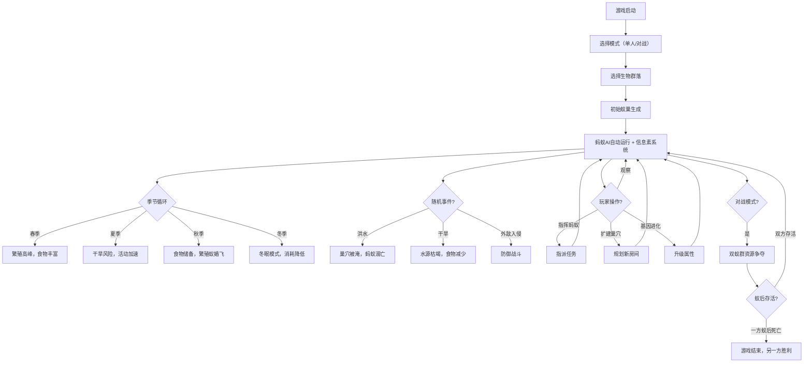

## 1. 产品概述

蚂蚁部落模拟是一款科普自然类的蚁群模拟游戏，玩家以俯视视角观察和指挥蚂蚁部落在地下巢穴与地面世界的日常活动。通过觅食、挖掘、繁殖、防御等核心玩法，让玩家深入了解蚂蚁社会的分工协作与生态智慧，寓教于乐。

游戏支持单人生存模式和双人对战模式，玩家可以体验从建立一个小型蚁群到发展成繁荣帝国的完整过程，同时应对季节变化、自然灾害和外敌入侵等挑战。

- **目标用户**：自然爱好者、休闲游戏玩家、科普教育受众、策略游戏爱好者
- **产品价值**：以沉浸式互动体验科普蚂蚁生态，兼具策略性与观赏性
- **核心体验**：观察-指挥-成长-进化的完整游戏循环

## 2. 核心功能

### 2.1 用户角色

- **单人模式**：玩家扮演蚁群的"观察者与指挥者"，管理整个蚁群的生存与发展
- **双人对战模式**：两名玩家各自控制一个蚁群，在同一张地图上争夺领地和资源

### 2.2 功能模块（V2.0 新增）

| 序号 | 功能模块 | 描述 |
|-----|---------|------|
| 1 | **信息素AI系统** | 蚂蚁通过释放/感知信息素形成路径，分工协作，自适应觅食 |
| 2 | **蚂蚁类型进化** | 工蚁、兵蚁、繁殖蚁（雄蚁/雌蚁），可消耗资源升级属性 |
| 3 | **季节与灾害系统** | 春夏秋冬四季循环，雨季洪水、冬季冬眠、夏季干旱 |
| 4 | **蚁巢扩建系统** | 挖掘新房间（储藏室、育儿室、农场、兵营、王后室），建设功能区域 |
| 5 | **基因进化系统** | 培养抗病、速度、力量、载重、繁殖等基因属性，逐代强化 |
| 6 | **生物群落地图** | 森林、沙漠、草原、雨林四种生物群落，各有独特资源和挑战 |
| 7 | **蚁群对战模式** | 两名玩家分屏或轮流操作，争夺领地和资源，消灭对方蚁后获胜 |

### 2.3 原有功能模块

1. **主游戏页面**：俯视视角的蚁巢世界，包含地下巢穴和地面场景，蚂蚁自动活动，玩家可交互指挥
2. **状态面板**：实时显示食物储量、蚂蚁数量、蚁群状态等关键信息

### 2.4 页面详情

| 页面名称 | 模块名称 | 功能描述 |
|---------|---------|---------|
| 主游戏页面 | 地下巢穴视图 | 俯视视角展示蚁巢隧道、房间、蚁后室、育儿室等地下结构，蚂蚁在其中自动走动 |
| 主游戏页面 | 地面世界视图 | 展示地面场景，包含食物源、外敌、季节变化，支持4种生物群落 |
| 主游戏页面 | 信息素可视化 | 地面显示蚂蚁信息素路径（蓝色觅食/红色警戒），可开关显示 |
| 主游戏页面 | 蚂蚁AI行为系统 | 蚂蚁自动执行觅食、挖洞、照顾幼蚁、搬运食物等行为，遵循优先级和信息素引导 |
| 主游戏页面 | 玩家指挥系统 | 点击蚂蚁可选中，点击地面可指派任务，点击食物源标记采集 |
| 主游戏页面 | 资源管理系统 | 食物采集、消耗、存储的完整循环，新增水分、材料资源 |
| 主游戏页面 | 繁殖系统 | 蚁后定期产卵，新增繁殖蚁婚飞机制 |
| 主游戏页面 | 防御战斗系统 | 外敌入侵事件触发，兵蚁自动或被指挥前往防御 |
| 主游戏页面 | 季节系统 | 春夏秋冬四季变换，影响食物产量、蚂蚁活动效率 |
| 主游戏页面 | 自然灾害 | 随机触发洪水、干旱、暴风雪等灾害，造成资源损失和蚂蚁伤亡 |
| 主游戏页面 | 蚁巢扩建 | 可规划挖掘新房间，每种房间有独特功能加成 |
| 主游戏页面 | 基因进化面板 | 显示当前基因点和可升级属性，消耗食物进行进化 |
| 主游戏页面 | 生物群落选择 | 游戏开始前可选择4种生物群落地图 |
| 主游戏页面 | 对战模式UI | 双蚁群状态显示，领地边界可视化，胜利条件提示 |
| 状态面板 | 食物储量显示 | 实时显示当前食物总量、采集速率、消耗速率 |
| 状态面板 | 水分储量显示 | 新增，受干旱/雨季影响 |
| 状态面板 | 材料储量显示 | 新增，用于建造升级 |
| 状态面板 | 蚂蚁数量统计 | 按类型（蚁后、工蚁、兵蚁、繁殖蚁、幼蚁）显示数量 |
| 状态面板 | 基因属性显示 | 显示速度、力量、抗病、载重等基因等级 |
| 状态面板 | 蚁群状态指示 | 显示蚁群整体状态，重要事件通知 |
| 状态面板 | 季节/日历 | 显示当前季节、剩余天数，灾害预警 |

## 3. 核心流程



### 3.1 信息素觅食循环

```
工蚁外出 → 发现食物源 → 沿途释放觅食信息素 → 返回巢穴
     ↑                                    ↓
其他工蚁感知信息素 → 沿路径前往食物源 → 强化信息素浓度
     ↑                                    ↓
食物耗尽 → 信息素逐渐消散 → 工蚁探索新区域
```

### 3.2 蚂蚁进化流程

```
蚁后产卵 → 幼虫 → 选择培养方向（工/兵/繁殖蚁）
     ↓
消耗食物+材料 → 属性提升（速度/力量/载重）
     ↓
羽化 → 新蚂蚁携带基因属性 → 参与蚁群工作
     ↓
基因点累积 → 升级蚁群整体基因 → 后代属性提升
```

### 3.3 蚁巢扩建流程

```
选择房间类型 → 消耗材料 → 标记挖掘区域
     ↓
工蚁前往挖掘 → 房间成型 → 分配功能
     ↓
房间激活 → 提供加成（储藏容量/繁殖速度/防御加成）
```

### 3.4 对战模式流程

```
双方选择起始位置 → 各自发展蚁群
     ↓
领地扩张 → 边境冲突
     ↓
资源争夺 → 侦察与反侦察
     ↓
大规模战斗 → 攻击对方巢穴
     ↓
一方蚁后被消灭 → 游戏结束
```

## 4. 用户界面设计

### 4.1 设计风格

- **主色调**：大地色系——深棕色(#3E2723)为底色，琥珀色(#FF8F00)为强调色
- **辅助色**：
  - 森林绿(#2E7D32)代表森林群落
  - 沙漠黄(#F9A825)代表沙漠群落
  - 草原绿(#8BC34A)代表草原群落
  - 雨林绿(#00695C)代表雨林群落
- **季节色彩叠加**：
  - 春季：粉色调(#F48FB1) 20%透明度叠加
  - 夏季：金色调(#FFD54F) 20%透明度叠加
  - 秋季：橙色调(#FF8A65) 20%透明度叠加
  - 冬季：蓝色调(#90CAF9) 30%透明度叠加
- **信息素颜色**：
  - 觅食路径：淡蓝色(#42A5F5) 半透明
  - 警戒路径：暗红色(#EF5350) 半透明
  - 归巢路径：淡黄色(#FFEE58) 半透明
- **按钮风格**：圆润3D风格，带有泥土质感的纹理，悬停时有微光效果
- **字体**：标题使用"ZCOOL KuaiLe"（站酷快乐体），正文使用"Noto Sans SC"
- **布局风格**：左侧游戏画布，右侧状态面板，顶部菜单栏，底部快捷栏
- **对战模式布局**：左右分屏或上下分屏，中间显示状态对比

### 4.2 新增UI元素详情

| 模块 | UI元素 | 设计描述 |
|-----|--------|---------|
| **信息素系统** | 信息素开关按钮 | 顶部工具栏，图标为蓝色水滴，点击切换显示/隐藏 |
| | 路径可视化 | Canvas半透明绘制，浓度高则颜色深，随时间淡出 |
| **季节系统** | 季节指示器 | 顶部圆形图标，显示当前季节图标+剩余天数 |
| | 灾害预警 | 红色闪烁图标，提前3天预警即将到来的灾害 |
| **基因进化** | 基因面板按钮 | 右侧面板顶部，DNA双螺旋图标 |
| | 基因升级界面 | 弹出面板，六边形属性雷达图，可点击升级 |
| | 属性进度条 | 速度、力量、抗病、载重、繁殖五项，Lv1-Lv10 |
| **蚁巢扩建** | 建造模式按钮 | 底部快捷栏，铲子图标 |
| | 房间选择菜单 | 6种房间卡片，显示材料消耗和功能说明 |
| | 建造预览 | 半透明显示拟建房间位置，绿色=可建，红色=不可建 |
| **生物群落** | 开始菜单选择 | 4张大图卡片，展示各群落特色 |
| | 群落特色标签 | 游戏内左上角显示当前群落名称和图标 |
| **对战模式** | 双方状态条 | 屏幕顶部左右两侧，显示双方蚁群健康度 |
| | 领地边界 | 半透明彩色边界线，显示各自控制范围 |
| | 小地图 | 右下角小地图，显示双方位置和兵力分布 |

### 4.3 动效设计（新增）

- **信息素扩散动画**：从蚂蚁位置向外扩散的半透明波纹效果
- **挖掘建造动画**：房间轮廓从虚线逐渐变为实线，伴随粒子效果
- **季节过渡动画**：画面色彩逐渐过渡（10秒渐变）
- **灾害预警动画**：图标放大-缩小闪烁，边缘红色脉冲
- **基因升级动画**：六边形雷达图展开，属性点发光上升
- **繁殖蚁婚飞动画**：繁殖蚁成群飞向天空，形成浪漫的粒子轨迹
- **对战战斗动画**：双方蚂蚁交战区域高亮，伤害数字弹出

### 4.4 房间类型

| 房间类型 | 材料消耗 | 功能 | 解锁条件 |
|---------|---------|------|---------|
| 储藏室 | 20材料 | 食物容量+50 | 初始 |
| 育儿室 | 30材料 | 繁殖速度+20% | 10只蚂蚁 |
| 农场 | 50材料 | 可种植真菌，稳定产出食物 | 20只蚂蚁 |
| 兵营 | 40材料 | 兵蚁训练速度+30%，攻击力+10% | 15只蚂蚁 |
| 王后室 | 60材料 | 蚁后产卵速度+50% | 30只蚂蚁 |
| 蓄水池 | 35材料 | 水容量+30，抗旱能力+50% | 15只蚂蚁 |

### 4.5 蚂蚁类型与升级

| 类型 | 基础属性 | 可升级属性 | 升级消耗 |
|-----|---------|-----------|---------|
| **工蚁** | 速度1.2，攻击3，生命40，载重10 | 速度、载重、效率 | 食物15+材料5/级 |
| **兵蚁** | 速度0.8，攻击8，生命70，载重5 | 攻击力、生命、护甲 | 食物20+材料10/级 |
| **繁殖蚁** | 速度1.0，攻击2，生命30 | 繁殖力、寿命 | 食物30+材料15/级 |

### 4.6 生物群落特色

| 群落 | 食物类型 | 特殊敌人 | 气候特点 | 优势 | 劣势 |
|-----|---------|---------|---------|------|------|
| **森林** | 树叶、果实、昆虫丰富 | 蜘蛛、甲虫 | 温和湿润，四季分明 | 食物充足 | 雨季易洪水 |
| **沙漠** | 种子、稀少昆虫 | 蝎子、蜥蜴 | 干旱少雨，昼夜温差大 | 外敌少 | 食物稀少，易干旱 |
| **草原** | 草籽、蚜虫蜜露 | 食蚁兽、鸟 | 季节性明显，大风 | 视野开阔 | 冬季严寒 |
| **雨林** | 丰富果实、昆虫、花蜜 | 行军蚁、寄生蜂 | 高温高湿，多雨 | 食物极丰富 | 疾病多，竞争激烈 |

### 4.7 灾害系统

| 灾害 | 发生季节 | 概率 | 效果 | 应对策略 |
|-----|---------|------|------|---------|
| **洪水** | 春季/夏季 | 15% | 巢穴被淹，下层房间进水，蚂蚁溺亡，食物发霉 | 建造蓄水池，巢穴建在高处 |
| **干旱** | 夏季 | 20% | 水源枯竭，食物减产50%，蚂蚁脱水死亡 | 储备充足水，建造蓄水池 |
| **暴风雪** | 冬季 | 25% | 温度骤降，蚂蚁活动停止，消耗增加 | 储备充足食物，深度冬眠 |
| **疾病** | 雨林夏季 | 30% | 蚂蚁生病，传染全群，不加干预可能团灭 | 升级抗病基因，隔离病蚁 |
| **野火** | 草原夏季 | 10% | 地面食物被烧毁，地表蚂蚁烧死 | 地下深处避难，等待火灾过去 |
