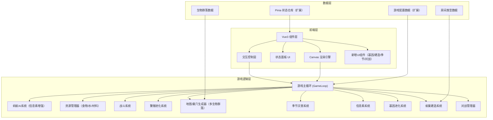

## 1. 架构设计



## 2. 技术说明

- **前端框架**：Vue3 + TypeScript
- **构建工具**：Vite
- **样式方案**：原生CSS + CSS Variables（主题色管理）
- **状态管理**：Pinia
- **渲染引擎**：HTML5 Canvas 2D（游戏画面渲染）
- **动画库**：requestAnimationFrame 原生游戏循环
- **无后端**：纯前端单机游戏，数据存储在内存中
- **对战模式**：本地双人轮流操作或分屏操作

## 3. 路由定义

| 路由 | 用途 |
|------|------|
| `/` | 游戏主菜单（模式选择、生物群落选择） |
| `/game` | 游戏主页面，包含游戏画布和状态面板 |
| `/battle` | 对战模式页面，双人分屏 |

## 4. 核心系统设计（V2.0 新增）

### 4.1 信息素系统 (PheromoneSystem)

**数据结构**：
- 网格化信息素地图，每格存储3种信息素浓度（觅食/警戒/归巢）
- 浓度范围 0.0-1.0，随时间自然衰减（0.005/秒）
- 蚂蚁移动时释放信息素，浓度随距离衰减

**算法**：
```
蚂蚁发现食物 → 沿途释放觅食信息素（浓度=0.8）
其他蚂蚁感知范围内信息素 → 向浓度最高方向移动
到达食物源 → 强化信息素浓度（+0.2）
食物耗尽 → 信息素自然衰减 → 路径逐渐消失
```

**优化策略**：
- 信息素地图仅更新变化区域，避免全网格遍历
- 使用邻域扩散算法模拟信息素自然扩散
- 可开关可视化，关闭时不渲染但逻辑仍运行

### 4.2 季节与灾害系统 (SeasonSystem)

**季节循环**：
- 每季节持续 2 分钟（游戏时间，可加速）
- 季节转换过渡动画 10 秒
- 季节效果：
  - 春季：繁殖速度 +30%，食物产出 +20%，洪水风险
  - 夏季：蚂蚁速度 +20%，食物产出 -10%，干旱风险
  - 秋季：食物产出 +40%，繁殖蚁婚飞，繁殖速度 +50%
  - 冬季：蚂蚁速度 -40%，食物消耗 -50%，暴风雪风险

**灾害触发**：
- 每季节开始时随机判定是否发生灾害
- 提前 3 天（游戏时间）预警
- 灾害持续 10-20 秒
- 效果计算基于蚁群状态（是否有蓄水池/抗病基因等）

### 4.3 基因进化系统 (GeneSystem)

**基因属性**：
| 基因 | 效果 | 每级提升 | 满级 |
|-----|------|---------|------|
| 速度 | 蚂蚁移动速度 | +10% | Lv10 |
| 力量 | 蚂蚁攻击力/防御力 | +15% | Lv10 |
| 抗病 | 疾病抵抗力 | +20% | Lv10 |
| 载重 | 工蚁携带食物量 | +10% | Lv10 |
| 繁殖 | 蚁后产卵速度 | +15% | Lv10 |

**进化机制**：
- 每次新蚂蚁孵化获得 1 基因点
- 消耗基因点和食物升级属性
- 升级后所有新生蚂蚁获得属性加成
- 满级后解锁特殊变异（如：飞行工蚁、巨型兵蚁）

### 4.4 蚁巢建造系统 (BuildSystem)

**房间类型数据**：
```typescript
interface RoomType {
  id: string
  name: string
  description: string
  size: { width: number, height: number }
  cost: { material: number, food: number }
  unlockCondition: { antCount?: number, geneLevel?: number }
  effects: {
    foodCapacity?: number
    waterCapacity?: number
    reproductionBonus?: number
    attackBonus?: number
    foodProduction?: number
    diseaseResist?: number
  }
}
```

**建造流程**：
1. 玩家选择房间类型 → 系统检查解锁条件和资源
2. 进入建造预览模式，鼠标移动显示可建造区域（绿色/红色）
3. 点击确认 → 消耗资源 → 标记挖掘区域
4. 工蚁自动前往挖掘 → 挖掘进度条 0-100%
5. 建造完成 → 房间激活 → 效果生效

### 4.5 生物群落系统 (BiomeSystem)

**四种生物群落配置**：

| 群落 | 地表色调 | 食物丰度 | 敌人类型 | 特殊机制 |
|-----|---------|---------|---------|---------|
| 森林 | 深绿 | 1.2x | 蜘蛛、甲虫 | 雨季洪水 |
| 沙漠 | 沙黄 | 0.6x | 蝎子、蜥蜴 | 昼夜温差，干旱 |
| 草原 | 草绿 | 0.9x | 食蚁兽、鸟 | 大风，野火 |
| 雨林 | 墨绿 | 1.5x | 行军蚁、寄生蜂 | 高湿度，疾病 |

**地图生成器扩展**：
- 根据生物群落类型调整地形生成算法
- 食物源类型和分布随群落变化
- 敌人类型池和出现概率差异化
- 地表装饰物（树木/仙人掌/草丛）符合群落特色

### 4.6 对战模式系统 (BattleSystem)

**游戏规则**：
- 两名玩家各控制一个蚁群
- 地图两侧各有一个初始巢穴入口
- 胜利条件：消灭对方蚁后
- 领地控制：蚂蚁活动范围决定领地边界
- 资源争夺：地图中央食物源为兵家必争之地

**操作模式**：
- 轮流操作：计时器控制，每玩家30秒操作时间
- 分屏操作：左右分屏，各显示己方蚁群状态
- 快捷键：玩家1使用WASD+空格，玩家2使用方向键+回车

**特殊对战机制**：
- 侦察：可派遣工蚁探索对方领地
- 偷袭：兵蚁可潜入对方巢穴破坏
- 间谍：繁殖蚁可混入对方蚁群
- 结盟：可选规则，可临时结盟对抗AI

## 5. 数据模型扩展

### 5.1 新增数据结构

```mermaid
erDiagram
    "蚁群" ||--o{ "信息素地图" : "拥有"
    "蚁群" ||--o| "基因属性" : "拥有"
    "蚁群" ||--o{ "房间" : "拥有"
    "蚁群" ||--o| "季节状态" : "受影响"
    "信息素地图" {
        "number[][] foraging 觅食信息素"
        "number[][] alarm 警戒信息素"
        "number[][] homing 归巢信息素"
    }
    "基因属性" {
        "number speed 速度等级"
        "number strength 力量等级"
        "number diseaseResist 抗病等级"
        "number capacity 载重等级"
        "number reproduction 繁殖等级"
        "number genePoints 可用基因点"
    }
    "房间" {
        "string id"
        "string type 类型"
        "number gridX"
        "number gridY"
        "number width"
        "number height"
        "number buildProgress 建造进度"
        "bool active 是否激活"
    }
    "季节状态" {
        "string currentSeason 春夏秋冬"
        "number dayInSeason 季节内天数"
        "string upcomingDisaster 预警灾害"
        "number disasterCountdown 灾害倒计时"
        "number activeDisaster 活跃灾害"
    }
    "生物群落配置" {
        "string id"
        "string name"
        "string[] foodTypes"
        "string[] enemyTypes"
        "object modifiers 属性修正"
    }
```

### 5.2 扩展数据模型

```mermaid
erDiagram
    "蚂蚁" {
        "string id PK"
        "string type 工蚁/兵蚁/蚁后/繁殖蚁"
        "number x"
        "number y"
        "string state"
        "number health"
        "number hunger"
        "number thirst 新增：口渴值"
        "number geneBonus 基因加成系数"
        "number level 个体等级"
        "bool isSick 是否生病"
        "string targetId"
    }
    "资源" {
        "number food"
        "number maxFood"
        "number water 新增：水"
        "number maxWater 新增：最大水"
        "number material 新增：材料"
        "number maxMaterial 新增：最大材料"
        "number foodRate"
        "number waterRate"
    }
```

## 6. 项目目录结构（扩展）

```
src/
├── main.ts
├── App.vue
├── assets/styles/
├── game/
│   ├── GameLoop.ts
│   ├── Ant.ts
│   ├── Enemy.ts
│   ├── Colony.ts
│   ├── MapGenerator.ts
│   ├── CombatSystem.ts
│   ├── ReproductionSystem.ts
│   ├── ResourceManager.ts
│   ├── PheromoneSystem.ts       # 新增：信息素系统
│   ├── SeasonSystem.ts          # 新增：季节灾害系统
│   ├── GeneSystem.ts            # 新增：基因进化系统
│   ├── BuildSystem.ts           # 新增：蚁巢建造系统
│   ├── BiomeSystem.ts           # 新增：生物群落系统
│   └── BattleSystem.ts          # 新增：对战模式系统
├── renderer/
│   ├── CanvasRenderer.ts
│   ├── ParticleSystem.ts
│   ├── PheromoneRenderer.ts     # 新增：信息素渲染
│   ├── SeasonRenderer.ts        # 新增：季节效果渲染
│   └── UIRenderer.ts
├── stores/
│   └── gameStore.ts
├── components/
│   ├── GameCanvas.vue
│   ├── StatusPanel.vue
│   ├── AntDetail.vue
│   ├── SpeedControl.vue
│   ├── GenePanel.vue            # 新增：基因进化面板
│   ├── BuildPanel.vue           # 新增：建造面板
│   ├── SeasonIndicator.vue      # 新增：季节指示器
│   ├── BiomeSelect.vue          # 新增：生物群落选择
│   ├── MainMenu.vue             # 新增：主菜单
│   └── BattleUI.vue             # 新增：对战UI
├── data/
│   ├── biomes.ts                # 新增：生物群落配置
│   ├── rooms.ts                 # 新增：房间类型配置
│   └── disasters.ts             # 新增：灾害配置
└── utils/
    ├── constants.ts
    └── helpers.ts
```

## 7. 性能优化策略

1. **信息素系统优化**：
   - 分区域更新，仅更新有蚂蚁活动的区域
   - 每 5 帧更新一次信息素扩散
   - 使用类型化数组 `Float32Array` 存储信息素数据

2. **渲染优化**：
   - 信息素可视化使用离屏 Canvas 预渲染
   - 季节色彩叠加使用 CSS filter，避免 Canvas 重绘
  - 仅渲染视口内的元素

3. **AI 优化**：
   - 蚂蚁 AI 分批次更新，每帧更新 1/3 的蚂蚁
   - 使用空间分区网格加速碰撞检测和敌人搜索
   - 信息素感知使用邻域查找，避免全地图遍历

4. **对战模式优化**：
   - 双蚁群逻辑并行更新（使用 `Promise.all`）
   - 独立的状态快照，支持回退和复盘
   - 输入事件队列化，确保操作顺序正确

## 8. 兼容性说明

- 所有 V2.0 新功能均为增量添加，不破坏原有功能
- 单人模式保持原有操作习惯，新功能通过菜单渐进解锁
- 对战模式为可选模式，不影响单人模式体验
- 所有新增资源（水/材料）在单人模式下有合理的获取途径
