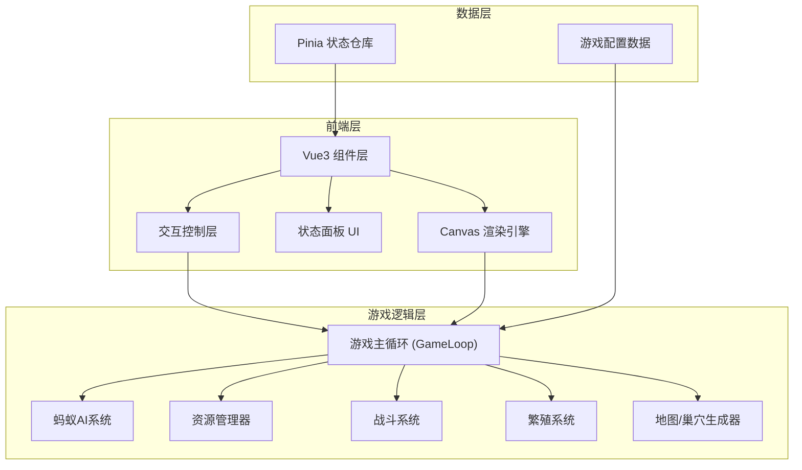

## 1. 架构设计



## 2. 技术说明

- **前端框架**：Vue3 + TypeScript
- **构建工具**：Vite
- **样式方案**：原生CSS + CSS Variables（主题色管理）
- **状态管理**：Pinia
- **渲染引擎**：HTML5 Canvas 2D（游戏画面渲染）
- **动画库**：requestAnimationFrame 原生游戏循环
- **无后端**：纯前端单机游戏，数据存储在内存中

## 3. 路由定义

| 路由 | 用途 |
|------|------|
| `/` | 游戏主页面，包含游戏画布和状态面板 |

## 4. 核心系统设计

### 4.1 游戏主循环 (GameLoop)

```
requestAnimationFrame 驱动
  → 更新时间步长（支持暂停/倍速）
  → 更新蚂蚁AI状态
  → 更新资源消耗
  → 检查事件触发（外敌入侵、繁殖等）
  → 渲染Canvas画面
  → 更新UI状态面板
```

### 4.2 蚂蚁AI系统

蚂蚁行为优先级（从高到低）：
1. **紧急防御**：外敌入侵时兵蚁自动响应
2. **饥饿进食**：自身饥饿值过高时前往仓库进食
3. **玩家指令**：玩家指定的任务
4. **自动任务**：根据蚁群需求自动分配（觅食/挖掘/照顾幼蚁）

蚂蚁类型：
| 类型 | 职责 | 属性侧重 |
|------|------|---------|
| 蚁后 | 产卵繁殖 | 不移动，高生命值 |
| 工蚁 | 觅食、挖掘、照顾幼蚁 | 高速度，中等载重 |
| 兵蚁 | 巡逻、防御外敌 | 高攻击力，高生命值 |
| 幼蚁 | 成长中，无行为 | 需要工蚁喂食照顾 |

### 4.3 地图系统

**地下巢穴**：
- 网格化地图（每格代表一个可挖掘单位）
- 预设初始巢穴结构（蚁后室 + 1条隧道 + 1个育儿室）
- 墙壁可被工蚁挖掘，形成新通道和房间
- 巢穴温度/湿度影响繁殖效率

**地面世界**：
- 开放式地图，随机生成食物源
- 食物源类型：树叶（少量食物）、果实（中量食物）、死虫（大量食物）
- 外敌从地图边缘出现
- 巢穴入口连接地下与地面

### 4.4 战斗系统

- 外敌类型：蜘蛛（高攻击）、敌对蚁群（数量多）
- 战斗为自动进行，蚂蚁接触敌人后根据攻击力/生命值计算伤害
- 玩家可通过指挥更多蚂蚁增援
- 战斗失败则参战蚂蚁死亡，敌人进入巢穴破坏

### 4.5 繁殖系统

- 蚁后每隔一定游戏时间产下一枚卵
- 卵需要在育儿室由工蚁照顾
- 生命周期：卵(30s) → 幼虫(60s) → 蛹(45s) → 成蚁（随机工蚁/兵蚁）
- 食物充足时繁殖速度加快，食物不足时蚁后停止产卵

## 5. 数据模型

### 5.1 数据模型定义

```mermaid
erDiagram
    "蚁群" ||--o{ "蚂蚁" : "包含"
    "蚁群" ||--o| "资源" : "拥有"
    "蚁群" ||--o{ "卵" : "拥有"
    "蚁群" ||--|| "巢穴地图" : "占据"
    "蚂蚁" {
        "string id PK"
        "string type 工蚁/兵蚁/蚁后"
        "number x"
        "number y"
        "string state 空闲/觅食/挖掘/战斗/照顾"
        "number health"
        "number hunger"
        "string targetId 目标ID"
    }
    "资源" {
        "number food"
        "number foodRate 食物变化率"
    }
    "卵" {
        "string id PK"
        "string stage 卵/幼虫/蛹"
        "number timer 阶段倒计时"
    }
    "巢穴地图" {
        "string[][] grid 网格数据"
        "number width"
        "number height"
    }
    "外敌" {
        "string id PK"
        "string type 蜘蛛/敌对蚁"
        "number x"
        "number y"
        "number health"
        "number attack"
    }
```

## 6. 项目目录结构

```
src/
├── main.ts                    # 应用入口
├── App.vue                    # 根组件
├── assets/
│   └── styles/
│       └── main.css           # 全局样式
├── game/
│   ├── GameLoop.ts            # 游戏主循环
│   ├── Ant.ts                 # 蚂蚁类（AI行为、移动）
│   ├── Enemy.ts               # 外敌类
│   ├── Colony.ts              # 蚁群管理器
│   ├── MapGenerator.ts        # 地图/巢穴生成
│   ├── CombatSystem.ts        # 战斗系统
│   ├── ReproductionSystem.ts  # 繁殖系统
│   └── ResourceManager.ts     # 资源管理
├── renderer/
│   ├── CanvasRenderer.ts      # Canvas渲染引擎
│   ├── AntRenderer.ts         # 蚂蚁渲染
│   ├── MapRenderer.ts         # 地图渲染
│   ├── UIRenderer.ts          # 游戏内UI渲染（选中框等）
│   └── ParticleSystem.ts      # 粒子效果系统
├── stores/
│   └── gameStore.ts           # Pinia游戏状态仓库
├── components/
│   ├── GameCanvas.vue         # 游戏画布组件
│   ├── StatusPanel.vue        # 状态面板组件
│   ├── AntDetail.vue          # 蚂蚁详情弹窗
│   └── SpeedControl.vue       # 速度控制组件
└── utils/
    ├── constants.ts           # 游戏常量配置
    └── helpers.ts             # 工具函数
```
